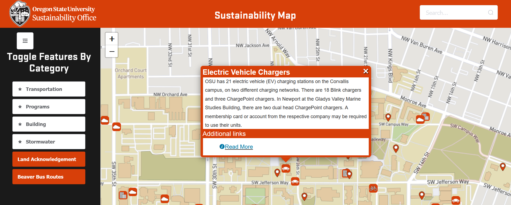
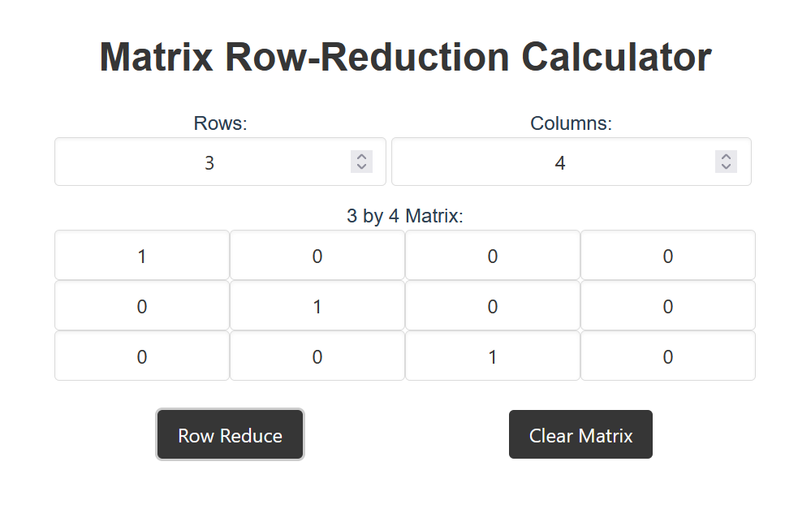
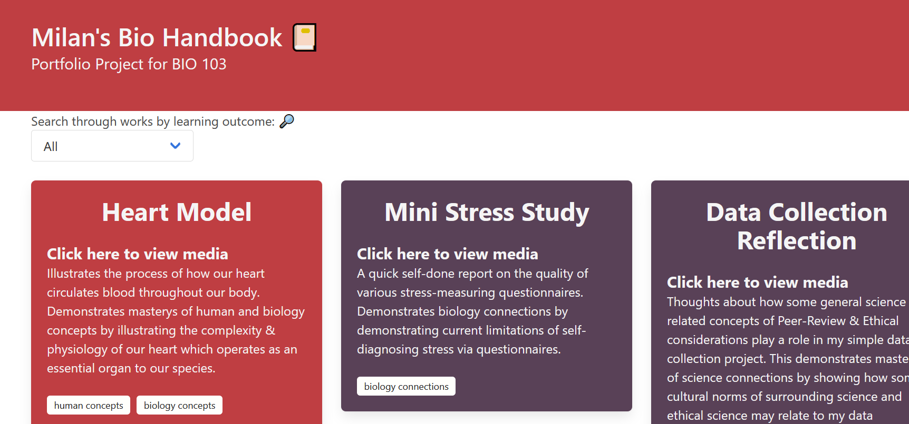

 
# **Overview**
This is a list of my most notable projects which I've worked on in the past few years outside of my academic work..
 
 
# Work Projects (Sustainability Office)
These are the public projects I've worked on while working as a part-time student software developer.
 
## **Sustainability Map**
This is an interactive infographic map of the OSU Corvallis campus which I mostly wrote from the ground-up using Vue-CLI with leaflet. You can view the app [here](https://dashboard.sustainability.oregonstate.edu/sustainability_map) and the source code [here](https://github.com/OSU-Sustainability-Office/sustainability_map).
 

 
Some cool notes about this project:
 - Fetches GeoJSON building geometry at build-time through OpenStreetMaps' Overpass API.
 - Uses a centralized Vuex store to manage building features
 - Is displayed as a page on the Energy Dashboard through an iframe!
 
 
## **Energy Dashboard**
A large serverless application developed by prior student employees which I've been maintaining and extending for the last year or so. You can view the application [here](https://dashboard.sustainability.oregonstate.edu/) and it's source code [here](https://github.com/OSU-Sustainability-Office/energy-dashboard).

Here's an itemized list of some of the contributes I've made towards the project:
 - Added dockerized API unit-tests in Jest to the Continuous Integration pipeline
 - Migrated client-cache from localStorage API to IndexedDB
 - Added support for Solar Arrays across Campus (wrote automated web-scrapers which fetch and upload data)
 - Optimized the application to "batch" data-requests (previously requested data for each meter--for certain buildings that meant 30 requests for 1 building)
 - Updated front-end documentation
 - Fixed miscellaneous bugs (zero reading error, local CORS testing error)
 
 
# Personal Projects
 
## **RREF Calculator (Vue)**
This is a simple RREF calculator which I made to help me out in my Linear Algebra class back early 2021.
 

 
You can check-out the source code [here](https://github.com/MilanDonhowe/rref)--or alternatively visit the web-app [here](https://main.d1ockk36rcpxaq.amplifyapp.com/).
 
## **𝓤𝙣𝙞𝙛𝙤𝙧𝙢: Unicode Text Formatter (React)**
A simple unicode text formatter built off the Create-React-App project template.
 

 
You can check out the source code [here](https://github.com/MilanDonhowe/uniform) or visit the website yourself [here](https://milandonhowe.github.io/uniform/).
 
## **Term-card: No data-store note card sharing (Vue/Bulma/LZMA.js)**
Effectively a hacked version of topaz's paste (a no data-share source code sharing app for advent of code) designed for general purpose notecard sharing.
 
Basically works by storing the compressed base-64 encoded notecard data in the web-page URL.
 

 
You can check out the source code [here](https://github.com/MilanDonhowe/term-card) or visit the website yourself [here](https://milandonhowe.github.io/term-card/).
 
## **Biology Portfolio (Bulma)**
A simple but stylish website I made for my final project in my Bio 103: Human Anatomy Course during spring term of 2019.
 
The website was intended to showcase the variety of work I made during the term but also gave me the opportunity to leverage npm in stream lining my development process using a variety of neat tools like Babel, Webpack, Sass & Bulma.
 

 
You can check out the source code [here](https://github.com/MilanDonhowe/Biology-Portfolio) or visit the website yourself [here](https://web.engr.oregonstate.edu/~donhowem/bio/).
 
## **Computer Chess (C++ w/SDL 2.0)**
An implementation of 2 player computer chess with a GUI programmed in C++ with usage of the SDL 2.0 Library.
 

 
You can check out the source code [here](https://github.com/MilanDonhowe/chess)
 
 
# Smaller/Older Projects (made >2 years ago)
These are some older projects made either during high school or my freshman year of college which I'm including here for my own self interest, but aren't reflective of my current skill set.
 
 
###  **Poll-Boy (Python)**
Poll-Boy is a simple bot that I programmed using the library discord.py to add simple yes or no polls.  The idea was to make a better alternative to straw-polls for Discord servers.
 
The source code can be found [here](https://github.com/MilanDonhowe/Poll-Boy).
 
 

 
### **Back-Stabbers! (JavaScript)**

A game where you stab simple 8 bit sprites in order to gain points!  This game was made for the 13kJsGames 2019 code golfing competition  where projects were forced to be under 13 kilobytes.  This meant common and popular libraries like JQuery and most game frameworks were banned from being used.  This is the only game I made from 'scratch', that is without the help of a game engine like Unity or GameMaker.  **The game placed [50th out of 200 entries](https://2019.js13kgames.com/#winners).**  You can play a slightly more polished version of the game [here](https://milandonhowe.github.io/backstabbers13kb/)!
 
 
 
### **A Slimy Quest (Gamemaker Studio 1.4)**
.gif)
 
A mix of a basic platforming and pong game.  Made in 1 month for the 2018 GitHub GameOFF.  **My game placed 19th overall out of 328 entries**.  Most notably I also scored 11th place for the category of Theme Interpretation.  The Game's source code may be [viewed here](https://github.com/MilanDonhowe/SlimyQuest), the entry for the GameOff can be [viewed here](https://itch.io/jam/game-off-2018/rate/334522) and if you wish, [you can play it here](https://milandonhowe.itch.io/a-slimy-quest).
 
 
### **Dolt's Home (Unity 3D)**

 
A 3D game made over the course of my sophomore year of High School using Blender, Unity, BFXR and a couple more tools/libraries.  The project can be [found here](https://github.com/MilanDonhowe/DoltsHome).
 

 
### **Bear World! (Gamemaker Studio 1.4)**
A simple platforming game I made freshman year of High School for my Introduction to Programming Class.  Although it hasn't aged particularly well, [you can still play this game here!](https://milandonhowe.github.io/beargame/)
 
### **ToyCalc (C)**
A simple terminal calculator interface written using the NCURSES library C!
 

 
You can check out the source code [here](https://github.com/MilanDonhowe/toyCalc).
 
 
### **Langston's Ant (Python)**
An implementation of Langston's Ant using Python and Tkinter.  You can find the code [here](https://github.com/MilanDonhowe/ANT)
 

 
### **Comic Sans Bookmarklet (JavaScript)**
A small url-embedded block of JavaScript code that changes all the fonts on a given web-page to Comic Sans MS.  You can find the code [here](https://github.com/MilanDonhowe/bookmarklets).
 

