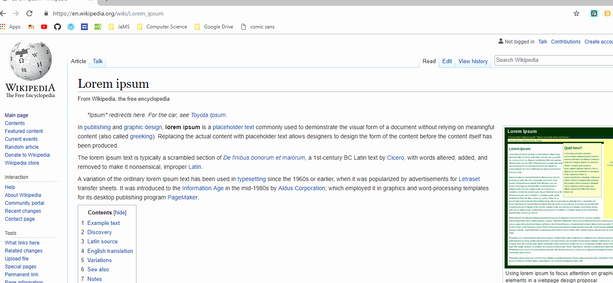

# **Projects**
Here is a list of my many projects, which will continue to expand throughout my life.

## **Chrome Extensions**

### **Student Selector**

A chrome extension which randomly selects a value from a list given by the user.  It was built to help Teachers randomly select students in a classroom without having to use those pesky Popsicle sticks.

[You can get it today for free at the Chrome web-store!](https://chrome.google.com/webstore/detail/student-randomizer/lcipncfbfemopganndembnmjjnhbaomk)
And/Or you can check out the [source code here](https://github.com/MilanDonhowe/studentSelect)

### **Amazon Price Tracker**
This was a chrome extension I programmed for my IB Computer Science IA (Internal Assessment).  It simply tracks the price of amazon products and notifies the user when a new product has been found.

[You can also get this chrome extension on the chrome web-store for free.](https://chrome.google.com/webstore/detail/amazon-price-tracker/npdolbglkedboekdpjcgfnnekcciedki/related)
And/Or you can check out the [source code here](https://github.com/MilanDonhowe/amazonTrackerIA/tree/master/Donhowe%20Milan%20IA/Forms/Product/amazonTracker)

## **Video Games**

### **A Slimy Quest (Gamemaker Studio 1.4)**
.gif)

A mix of a basic platforming and pong game.  Made in 1 month for the 2018 GitHub GameOFF.  **My game placed 19th overall out of 328 entries**.  Most notably I also scored 11th place for the category of Theme Interpretation.  The Game's source code may be [viewed here](https://github.com/MilanDonhowe/SlimyQuest), the entry for the GameOff can be [viewed here](https://itch.io/jam/game-off-2018/rate/334522) and if you wish, [you can play it here](https://milandonhowe.itch.io/a-slimy-quest).

### **Dolt's Home (Unity 3D)**

A 3D game made over the course of my Sophomore year using Blender, Unity, BFXR and a couple more tools/libraries.  The project can be [found here](https://github.com/MilanDonhowe/DoltsHome).

### **Bear World! (Gamemaker Studio 1.4)**
A simple platforming game I made Freshman year for my Introduction to Programming Class.  Although it hasn't aged particularly well and I would recommend playing A Slimy Quest over it, [you can still play this game here!](https://milandonhowe.github.io/beargame/)

## **Miscellaneous Programming Projects**

### **Comic Sans Bookmarklet (JavaScript)**
A small url-embedded block of JavaScript code that changes all the fonts on a given web-page to Comic Sans MS.  You can find the code [here](https://github.com/MilanDonhowe/bookmarklets).

###  **Poll-Boy (Python)**
Poll-Boy is a simple bot that I programmed using the library discord.py to add simple yes or no polls.  The idea was to make a better alternative to straw-polls for Discord servers.

The source code can be found [here](https://github.com/MilanDonhowe/Poll-Boy).

### **sMath (LUA)**
An on-going project of mine to build a simple math library in LUA.  GitHub repository can be found [here](https://github.com/MilanDonhowe/sMath).

### **Font Randomizer (JavaScript/Google App Script)**
A *very* simple program that randomly changes the font and font-size of a Google docs document.  Made after a dare in my English class.  The GitHub repository can be found [here](https://github.com/MilanDonhowe/Font_Randomizer).

 